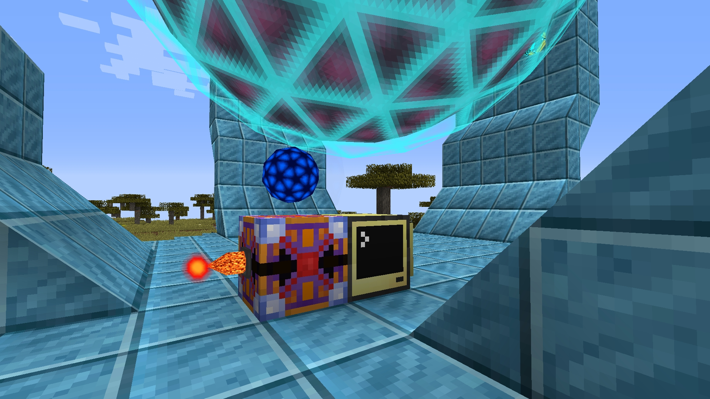
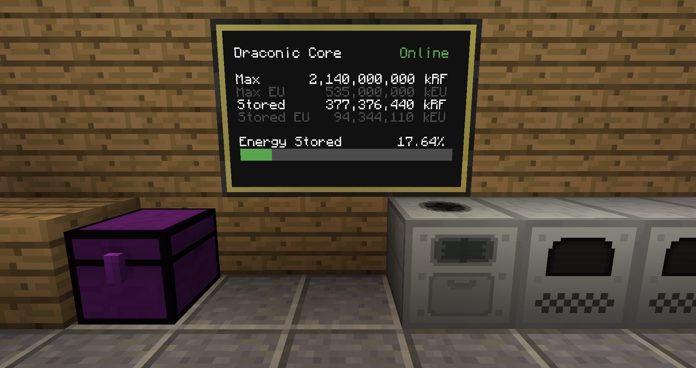
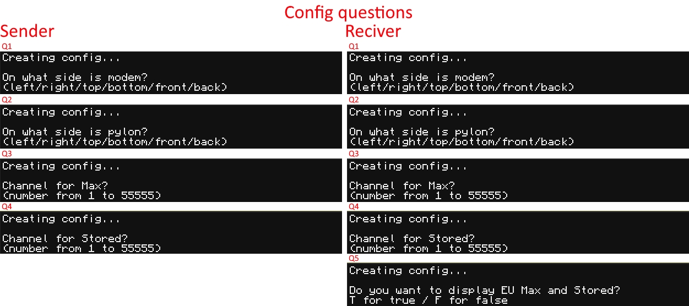
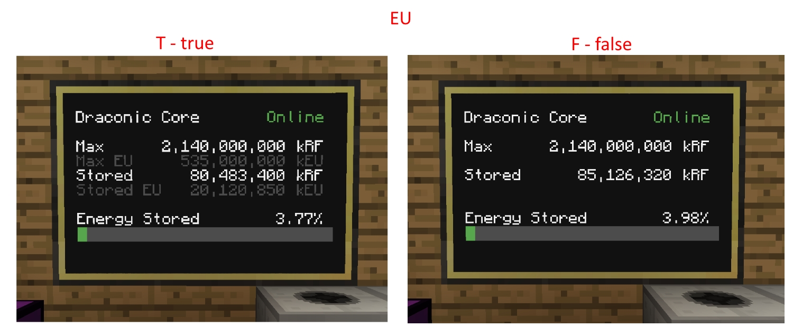
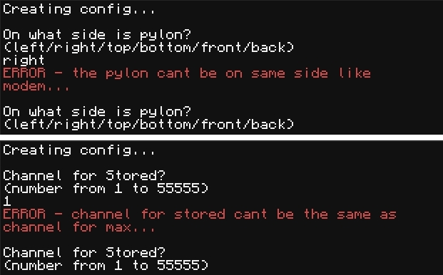
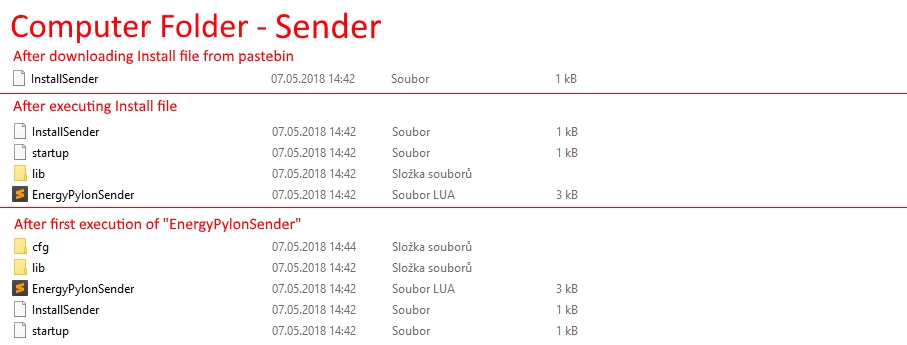
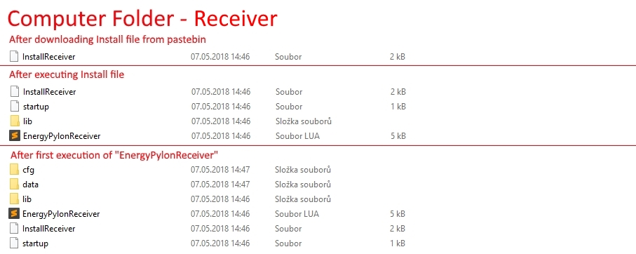

# Energy Core - info Sender/Receiver


> *Sender*


> *Receiver*

### Use
so this script written in LUA for ComputerCraft is made for monitoring stored energy in Energy Core form Draconic Evolution mod wirelessly on a 3x2 monitor

> *DISCLAIMER*: One library I am using isn't written by me... Its written by acidjazz - https://github.com/acidjazz.

### Features
- Configuration script
 	- both programs „EnergyPylonSender“ and „EnergyPylonReceiver“ contain a script which will automatically run on the first time of running these programs, that script will let you configure the position of the Pylon/Monitor and channels for data transfer

 	- the Configuration script of „EnergyPylonReceiver“ also contains the possibility to display the stored Energy in the kEU

 	- the ERROR message - the Configuration script also contains insurance that nothing can be placed on the same side of the computer and also the channels cannot be the same… for example when you have a modem on the left and monitor and the right side of the computer you cannot configure the program to have both things on the left side... the program will display the ERROR message


### Requirements
- 1x Fully built Energy Core with at least one Energy Pylon 
- 2x Advanced Computers
- 2x Ender Modems 
- 6x Advanced Monitors

### Video Installation and Tutorial
Hopefully in the future (read PS for more info)

### Written Installation and Tutorial
#### First computer (Sender)
After you have fully built your Energy Core with at least one Energy Pylon and you placed the first computer (with a modem on any side of the computer) next to the Energy Pylon, you will open the computer and download the installer for „EnergyPylonSender“ program with this line
```
> pastebin get j9kVqeJF InstallSender
```
this line will create an Install file that you will execute by typing this
```
> InstallSender
```
this installer will download necessary data and the program „EnergyPylonSender“ itself on that computer but before you run the „EnergyPylonSender“ program you better install the „EnergyPylonReceiver“ on the second computer  


> *Folder of the Sender*

#### Second Computer (Receiver)
After you decided where you want to have the monitor to show the stored energy in your Draconic Core, you just place the computer anywhere next to the monitor (the monitor and the computer must share one side) and then the modem anywhere on the computer then you will download the Install file for „EnergyPylonReceiver“ with line 
```
> pastebin get rsJdkWgp InstallReceiver
```
And then executing this file with
```
> InstallReceiver
```


> *Folder of the Receiver*

#### First execution and setup
```
> EnergyPylonSender
```
> *line for executing Sender program*
```
> EnergyPylonReceiver
```
> *line for executing Receiver program*
- after you execute the „EnergyPylonSender“ program on the first computer, you will be greeted with the configuration script where you will configure side of the Pylon and the modem and channels for „max“ and „stored“ (remember or write down these two numbers because they have to be the same on the second computer) after that you should see 3 lines (first one with „sending…“, second one with big number that represents maximum of energy that can be stored in that Energy Core and the third one with zero or some number that represents the energy stored in that Energy Core) do the same thing on the second computer with „EnergyPylonReceiver“ program (execute>configure>3 different lines and also the monitor should start working)

#### Startup
The startup will automatically start these programs on those computers so you don't have to execute them manually every time you load your save.

(Hope it was somewhat understandable... btw English isn't my first language)

### PS: 
- Maybe don't do it on the last eight tier of the Energy Core the numbers are just ridiculous. 
- If you have to edit config you have to edit it manually in the computer (edit cfg/...) or in the folder of that computer.
- And if anybody is willing to do video tutorial how to set up these computers just send me the link and I will place it here so anybody who wants to set it up can watch your video.
